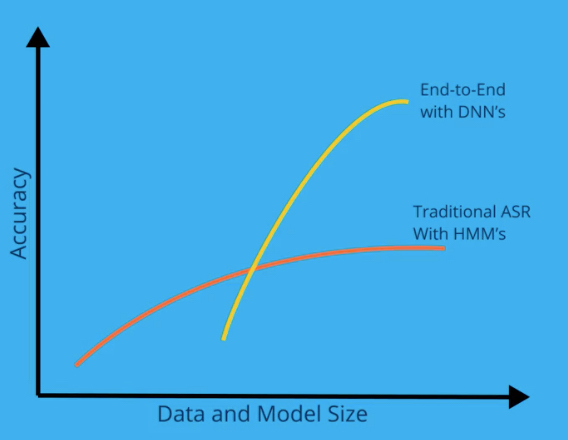

## 简述

中文语音识别项目。目前对于语音识别主要有两种实现方式。一种是传统的基于HMM的语言模型，比较经典的是GMM + HMM。其中 GMM 是高斯混合模型，使用GMM来对语音观察序列进行建模，HMM 则对语音的时序进行建模。一种是基于深度神经网络建模。主要是用CNN、RNN、CTC 来对语音序列进行建模、使用 语言模型进行解码。语言模型可以是HMM、N-grame、transfrom 等。

- 语音识别实现流程：

- - Speech 语音数据。
  - features 对语音数据进行特征提取。即声谱图、MFCC(梅尔倒谱系数)。
  - acoustic model 声学模型。对语音观察训练进行建模。项目采用 CNN+ CTC 。 CTC 是联合主义时序分类，擅长处理时序分类问题。
  - phonemes 音位。在任何给定语言中，[音位](https://en.wikipedia.org/wiki/Phoneme)是可用来区分字／词的最小音段。例如“bat”和“chat”只有一个声音不同，但是改变了单词。有区别的音位是“B”和“CH”。音位到底是哪些音位以及有多少音位会有所不同，可能会受到口音的影响。通常，美式英语包含 39 到 44 个音位。中文音位则是汉语拼音+音调。如 ‘xiao3’ （数字代表声调）。音位有声学模型输出。
  - words 。由音位获取到字，在汉语里一个拼音可能有多个汉字。
  - language model 。语言模型。将每个拼音通过语言模型进行解码得出文本。项目language 采用 transfrom 模型。主要负责分析上下文，得出每个音位对应的汉字。
  - text 文本。最终输出。

- 根据百度 Adam Coates 在最近的展示里称，就算对传统的 ASR 施加额外的训练，准确率也提高不了。而深度神经网络在处理小数据集上平平无奇，可一旦数据增加、模型加大、这种模型就能达到不错的效果。

  

### 数据集

语料数据集来自[thchs-30](http://www.openslr.org/18/)。[thchs-30](http://www.openslr.org/18/) 是由清华大学语音与语言技术中心（CSLT）发布的开放式中文语音数据库。原始记录是2002年由王冬在清华大学计算机科学系智能与系统国家重点实验室朱晓燕教授的监督下进行的，原始名称为“ TCMSD”，代表“清华连续大学”普通话语音数据库”。该数据库对学术用户完全免费。

[thchs-30](http://www.openslr.org/18/) 是在安静的办公室环境下，通过单个碳粒麦克风录取的，总时长超过30个小时。大部分参与录音的人员是会说流利普通话的大学生。采样频率16kHz，采样大小16bits。

相关参考

[THCHS-30：一个免费的中文语料库](https://blog.csdn.net/sut_wj/article/details/70662181)

[中文语音语料-THCHS30](http://blog.sina.com.cn/s/blog_8af106960102xdev.html)

论文：[THCHS-30 : A Free Chinese Speech Corpus](https://www.researchgate.net/publication/286301812_THCHS-30_A_Free_Chinese_Speech_Corpus)

使用 [icwb-data2](http://sighan.cs.uchicago.edu/bakeoff2005/) 数据集。来自SIGHAN，SIGHAN 是国际计算语言协会ACL中文处理小组的简称。目前SIGHAN bakeoff 已经举办了 6 届，其中语料资源免费。选用 icwb-data2 数据作为数据集。

### 评估

平均词错误率： 0. 77

### 使用

模型的使用方法参考：notebook/Chinese speech recognition.ipynb

个人云笔记：http://note.youdao.com/s/DoiiO0oX

环境：tensorflow-2.2、soundfile、python_speech_features 为必要的库。详细参考：requirements/requirements.txt 

### 总结

- 语料数据集[thchs-30](http://www.openslr.org/18/) 中训练数据集10000条，相比 LibriSpeech 不算特别大，这在训练模型时候会容易过拟合。
- 文本语料中存在重复的，使用语言模型训练。如果剔除重复的文本语料，则只有 750 条语料，这使用 transformer 模型训练比较容易过拟合，不能完全发挥神经网络的效果，这可能更适合 HMM 或 N-gram
- 网络模型，如果只使用 CNN 网络。CNN 网络不能有效的处理上下文信息，这可能导致在达到一定的效果之后，有比较难的提升。在音频数据比较长的时候，可能就需要更深的CNN网络才能保证信息的不丢失。

